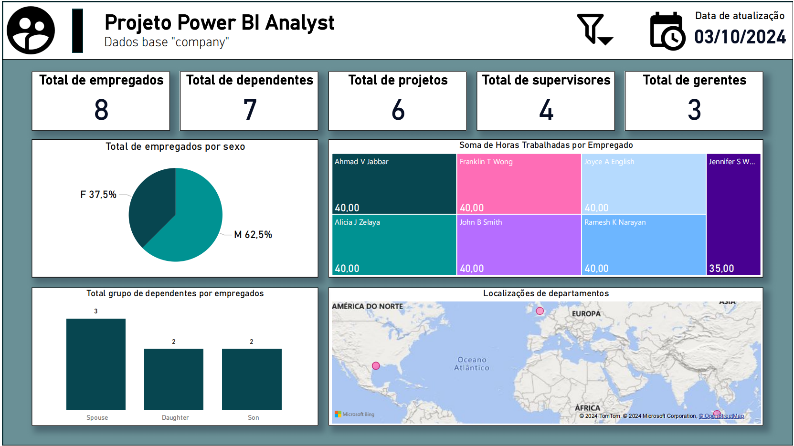

# Projeto de Análise de Dados - Azure e PostgreSQL

## Descrição

Este projeto envolve a geração de dados em ambientes de nuvem Azure utilizando MySQL e localmente no PostgreSQL. Os dados foram utilizados para construir um painel interativo no Power BI, que oferece insights e análises detalhadas.

## Estrutura do Projeto

- **docs/**: Esta pasta contém imagens do painel Power BI.
- **docs/sqls/**: Esta pasta contém os scripts de DML para ambos os ambientes (Azure MySQL e PostgreSQL), junto com imagens informativas do diagrama ER presente no Power BI.
- **Power BI Dashboard**: Um painel que foi estruturado em cima dos dados gerados, incluindo medidas adicionais para cálculos de cards informativos.
- **Menu de Filtro**: Adicionado um menu de filtro suspenso para permitir um controle mais eficaz sobre as visualizações de dados (a visualização deles estão no).

## Configuração do Ambiente

### Azure MySQL

1. Acesse o Azure Cloud e crie uma instância do MySQL.
2. Execute os scripts contidos na pasta `docs/sqls` para gerar os dados.

### PostgreSQL Local

1. Instale o PostgreSQL em sua máquina local.
2. Execute os scripts contidos na pasta `docs/sqls` para gerar os dados.

## Painel Power BI

O painel Power BI foi criado para visualizar e analisar os dados gerados. Medidas adicionais foram implementadas para aprimorar as informações apresentadas, e um menu de filtro suspenso foi adicionado para facilitar a interação do usuário.

### Funcionalidades do Painel

- Visualizações interativas baseadas nos dados.
- Cards informativos com cálculos adicionais.
- Filtros para controle dinâmico das visualizações.

### Imagens do Painel

**Painel Total:**

**Painel com Filtro Aberto:**

## Contribuições

Contribuições são bem-vindas! Sinta-se à vontade para abrir issues ou enviar pull requests.

## Licença

Este projeto está licenciado sob a [Licença MIT](LICENSE).
