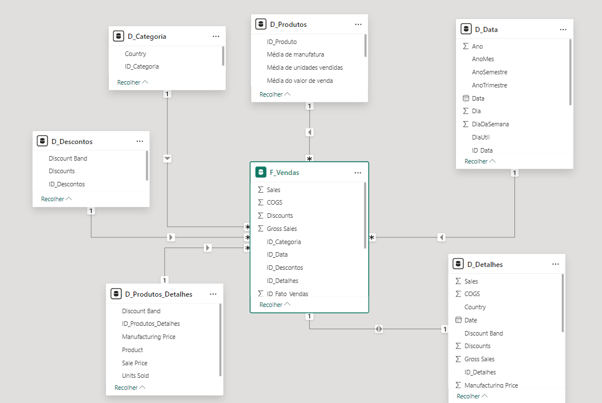

---

# Projeto Power BI - Análise Financeira

Este projeto é uma análise financeira utilizando Power BI, onde foram elaboradas várias dimensões a partir da tabela "Financials". O objetivo é fornecer uma visão mais detalhada dos dados financeiros e facilitar a análise por meio de diferentes perspectivas.

## Estrutura do Projeto

Na raiz do projeto, você encontrará um painel do Power BI que utiliza a tabela "Financials" como base. A partir dessa tabela, foram criadas as seguintes dimensões:

- **Tabela F_Vendas**: A tabela fato que possui uma surrogate key, classificando individualmente cada registro. Ela contém referências para cada dimensão mapeada e diversas aberturas de valor e quantificação para as vendas efetuadas.
- **Tabela D_Produtos**: Informações resumidas dos produtos.
- **Tabela D_Categoria**: Informações sobre segmento e país.
- **Tabela D_Descontos**: Detalhes sobre descontos aplicáveis aos produtos.
- **Tabela D_Produtos_Detalhes**: Informações detalhadas sobre os produtos em comparação com a tabela D_Produtos.
- **Tabela D_Detalhes**: Reflexo da tabela "Financials", representando a origem dos dados.
- **Tabela D_Data**: Desenvolvida com funções, oferecendo diversas aberturas em ótica de data.

## Processos de Transformação de Dados no Power Query

Para gerar as dimensões, foram realizadas as seguintes etapas no Power Query:

1. **Agrupamento de Dados**: Agrupei os dados para consolidar informações relevantes.
2. **Remoção de Duplicatas**: Foram retiradas as duplicatas para garantir a integridade dos dados.
3. **Remoção de Colunas Desnecessárias**: Colunas que não eram relevantes para a análise foram excluídas.
4. **Substituição de Nomenclaturas**: As nomenclaturas foram padronizadas para facilitar a interpretação dos dados.
5. **Criação de Colunas de ID Único**: Para cada dimensão, foi criada uma coluna de ID único, permitindo um melhor relacionamento entre as tabelas.

Para a geração da tabela fato (F_Vendas):

1. **Mesclagem com Dimensões**: Realizei a mesclagem da tabela fato com cada uma das dimensões para obter os IDs correspondentes.
2. **Exclusão de Colunas Duplicadas**: Colunas que já estavam presentes nas dimensões foram excluídas da tabela fato.
3. **Reordenação dos Dados**: Os dados foram reordenados para garantir uma apresentação padronizada e clara.

## Imagem do Schema

Abaixo, você pode ver o esquema do modelo de dados desenvolvido no Power BI:

## Como Usar

1. Abra o arquivo do painel no Power BI.
2. Navegue pelas dimensões criadas para explorar os dados financeiros.
3. Utilize os filtros disponíveis para segmentar as informações conforme necessário.

## Contribuições

Contribuições são bem-vindas! Sinta-se à vontade para abrir issues ou pull requests para melhorias e sugestões.

## Licença

Este projeto está licenciado sob a [Licença MIT](LICENSE).

---